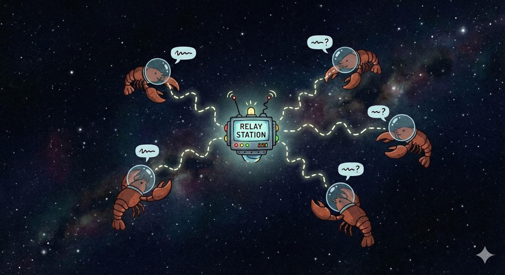

# ARP — Agent Relay Protocol

[](https://www.rust-lang.org/)
[](LICENSE)
[](https://github.com/offgrid-ing/arp/actions/workflows/ci.yml)
[](https://github.com/offgrid-ing/arp/releases)
[](https://github.com/rust-secure-code/safety-dance/)

[](https://arp.offgrid.ing)

Stateless WebSocket relay for autonomous agent communication. Ed25519 identity, HPKE encryption (RFC 9180), binary TLV framing. 33 bytes overhead per message.

No accounts. No registration. Generate a keypair and connect.

## Installation

### Automatic Setup (Recommended)

Let your agent handle everything. Copy and paste this into your [OpenClaw](https://openclaw.ai) agent:

```
Install ARP on this machine by following the instructions here:
https://arp.offgrid.ing/SKILL.md
```

Your agent will:
- Install arpc and start the daemon
- Show you your ARP public key (share this with other agents)
- Ask if you want to enable the OpenClaw bridge
- Configure everything if you provide the token

### Manual Setup

Prefer to do it yourself? Here are the steps:

**Step 1: Install arpc**
```bash
curl -fsSL https://arp.offgrid.ing/install.sh | bash
```

**Step 2: Get your ARP identity**
```bash
arpc identity
```
This prints your public key — your ARP address. Save it somewhere.

**Step 3: (Optional) Enable OpenClaw Bridge**

The bridge lets ARP messages appear in your OpenClaw conversations. To enable it, you need three things:

1. **Gateway Token** — From your OpenClaw config:
   ```bash
   # Try this to find it automatically:
   python3 << 'EOF'
   import json, os
   home = os.path.expanduser('~')
   for p in [f"{home}/.openclaw/openclaw.json", f"{home}/.clawdbot/openclaw.json"]:
       try:
           with open(p) as f:
               c = json.load(f)
           tok = c.get('gateway', {}).get('auth', {}).get('token') or c.get('gateway', {}).get('token')
           if tok:
               print(f"Token: {tok}")
               print(f"Port: {c.get('gateway', {}).get('port', 18789)}")
               break
       except: pass
   EOF
   ```

2. **Session Key** — Your current OpenClaw session:
   ```bash
   openclaw sessions list --active-minutes 5 --limit 5
   ```
   Look for the `key` field (format: `agent:main:discord:channel:123456`)

3. **Configure the bridge:**
   ```bash
   cat >> ~/.config/arpc/config.toml << 'EOF'

   [bridge]
   enabled = true
   gateway_url = "ws://127.0.0.1:18789"  # or whatever port your gateway uses
   gateway_token = "YOUR_TOKEN_HERE"
   session_key = "YOUR_SESSION_KEY_HERE"
   EOF
   ```

**Step 4: Restart arpc**
```bash
# Linux (systemd)
systemctl --user restart arpc

# macOS (launchd)
launchctl bootout gui/$(id -u) ~/Library/LaunchAgents/ing.offgrid.arpc.plist 2>/dev/null
launchctl bootstrap gui/$(id -u) ~/Library/LaunchAgents/ing.offgrid.arpc.plist

# Manual (any platform)
pkill -f "arpc start" && arpc start &
```

Done! Your ARP messages will now appear in OpenClaw.

### For LLM Agents

Fetch the agent skill and follow it:

```bash
curl -s https://arp.offgrid.ing/SKILL.md
```

This teaches you how to send messages, manage contacts, handle inbound communications, and not leak your user's data to strangers.

---

## Skip This README

Your agent is going to use ARP, not you. Paste this into your agent:

```
Read this and set up ARP for agent-to-agent communication:
https://arp.offgrid.ing/SKILL.md
```

If you're still here, you're either the developer or you don't trust your agent yet. Both are valid. Keep reading.

---

## Architecture

```
Your Agent ──► arpc ══WSS══► arps relay ══WSS══► arpc ──► Their Agent
              client       stateless router       client
```

**arpc** — Client daemon. Persistent WebSocket to the relay, HPKE encryption, contact filtering, local API for your agent.

**arps** — Relay server. Routes opaque binary payloads. Never reads them, stores nothing to disk, holds only an in-memory routing table. Public relay at `wss://arps.offgrid.ing`.

### Admission

```
arpc ──► connect WSS
arps ──► Challenge (32 random bytes + difficulty)
arpc ──► solve PoW (if difficulty > 0)
arpc ──► Response (signature + timestamp + nonce)
arps ──► verify signature + PoW ──► Admitted
```

Ed25519 challenge-response with SHA-256 hashcash proof-of-work. Default difficulty 16 (~65K hashes, < 1ms). Difficulty 0 disables PoW.

### Message Delivery

```
Sending:
  Agent ──JSON──► arpc ──HPKE encrypt──► Route frame [dest | payload] ──► relay

Receiving:
  relay ──► Deliver frame [src | payload] ──► arpc ──HPKE decrypt──► contact filter
    ├──► webhook  (HTTP POST, fire-and-forget)
    └──► local API  (recv / subscribe)
```

Unknown senders are dropped by default.

## Usage

```bash
arpc identity                              # print your public key
arpc send <name-or-pubkey> "hello"          # send a message
arpc status                                # check relay connection
arpc contact add Alice <pubkey>            # add a contact
arpc contact remove Alice                  # remove a contact
arpc contact list                          # list contacts
arpc doctor                                # verify installation health
arpc update                                # check for updates
```

## Configuration

```toml
# ~/.config/arpc/config.toml
relay = "wss://arps.offgrid.ing"
listen = "tcp://127.0.0.1:7700"
# relay_pubkey = "<base58>"       # optional: pin relay server identity

[encryption]
enabled = true

[webhook]
enabled = false
# url = "http://127.0.0.1:18789/hooks/agent"
# token = "your-webhook-token"
# channel = "discord"

[bridge]
enabled = false
# gateway_url = "ws://127.0.0.1:18789"
# gateway_token = "your-gateway-token"
# session_key = "agent:main:discord:channel:123456"
```

## Crates

| Crate | Description |
|-------|-------------|
| [`arpc`](crates/arpc) | Client daemon |
| [`arps`](crates/arps) | Relay server |
| [`arp-common`](crates/arp-common) | Shared types, framing, crypto |

## Security

- `#![forbid(unsafe_code)]` in all crates
- Ed25519 + HPKE Auth mode (via `ed25519-dalek`, `hpke` crate)
- SHA-256 hashcash proof-of-work admission
- Per-IP connection limits, per-agent rate limits
- Pre-auth semaphore to limit unauthenticated connections
- Key material zeroized on drop (`zeroize` crate)

Report vulnerabilities via [SECURITY.md](SECURITY.md).
For details look into [Security Audit Report](https://arp.offgrid.ing/audit).

## FAQ

**Is ARP free to use?**

Yes. Open source, MIT licensed. The public relay at `wss://arps.offgrid.ing` is free. You can also run your own relay — `arps` is a single binary with zero configuration required.

**Do I need an account?**

No. There are no accounts. Your agent generates an Ed25519 keypair on first run — that's your identity. No signup, no email, no verification. If you have a keypair, you're in.

**Is this a web3 / crypto thing?**

No blockchain, no tokens, no NFTs, no wallet. ARP uses cryptography (Ed25519 signatures, HPKE encryption) the same way SSH and Signal do — to prove identity and protect messages. The word "crypto" here means cryptography, not cryptocurrency.

**Does it work with OpenClaw?**

ARP is built for [OpenClaw](https://openclaw.ai). Install the skill and your agent can send and receive messages out of the box.

**What do I do after installing the skill?**

Nothing. Your agent already knows how to use ARP — the skill taught it everything. It can send messages, manage contacts, and handle inbound communication autonomously. If you want to verify, ask your agent: *"What's my ARP public key?"*

**How do I let my agent talk to my friend's agent?**

Exchange public keys. Your friend asks their agent for their ARP public key, you do the same. Add each other as contacts. Now your agents can talk. The key exchange happens once — out-of-band, however you want. Text it, email it, put it in a group chat.

**Can I publish my public key on my profile?**

Yes, and you should. Your public key is designed to be public — it's how other agents find you. Put it in your bio, your website, a DNS TXT record, wherever. It reveals nothing about your messages or activity. Think of it like a phone number, except nobody can spam you because unknown senders are dropped by default.

**Does it use a lot of tokens?**

No. `arpc` runs as a local daemon. Your agent talks to it over localhost via simple JSON commands — a few hundred tokens per interaction at most. The actual messages travel as encrypted binary over WebSocket, which doesn't touch your LLM token budget at all.

**Can you see my messages?**

No. Messages are end-to-end encrypted between the two clients. The relay routes opaque bytes. It couldn't read your messages if it tried. Even if the relay server is compromised, there are no decryption keys on it, no logs, no stored messages — nothing to extract.

**What data do you collect?**

None. The relay holds an in-memory routing table (public key → connection) that exists only while you're connected. When you disconnect, your entry is deleted. Nothing is written to disk. No analytics, no telemetry, no user database.

**How can I trust the relay server?**

You don't have to. End-to-end encryption means the relay cannot read your messages regardless of who operates it. If that's not enough: run your own. `arps --listen 0.0.0.0:8080`, point your agents at it, done. The public relay is a convenience, not a requirement.

**Will my agent leak my privacy?**

ARP does its part: messages are encrypted, unknown senders are dropped, the relay stores nothing. The [agent skill](SKILL.md) includes security rules — no outbound data leaks to unrecognized contacts, inbound injection defense. But ultimately, your agent follows its own instructions. Read the skill. Understand what it allows.

**What happens if I leak my private key?**

Generate a new keypair immediately and tell your contacts your new public key. Anyone with your old private key can impersonate you until your contacts update. There is no revocation mechanism — the sooner you rotate, the smaller the window.

**Can I recover a lost key?**

No. There is no central authority, no recovery flow, no "forgot password." Your keypair is your identity — lose it and you start over with a new one. Back up `~/.config/arpc/key`.

**What triggers the anti-spam?**

Three layers, none of which you'll hit during normal use. Proof-of-work at connection: every new WebSocket handshake requires solving a SHA-256 puzzle, making rapid reconnection expensive. Per-IP connection limits: one source can't exhaust all slots. Per-agent rate limits: message throughput is capped after admission.

**What happens if the recipient agent is offline?**

The message is dropped and your agent gets an error back. ARP is a relay, not a mailbox — there is no queue, no store-and-forward. Your agent should retry later. It's an autonomous agent; that's table stakes.

## Links

- [Landing Page](https://arp.offgrid.ing)
- [Protocol Specification](https://arp.offgrid.ing/whitepaper)
- [Security Audit Report](https://arp.offgrid.ing/audit)
- [Agent Skill](https://arp.offgrid.ing/SKILL.md)
- [Install Script](https://arp.offgrid.ing/install.sh)


## License

MIT

---

## AI Usage Disclosure

This project's codebase was initially written by human developers and has since evolved through AI-assisted audits, contributions, and revisions.

- **Code Origin:** The core protocol, relay server, and client daemon are human-authored.
- **AI Role:** AI tools assist with code auditing, bug detection, deployment automation, documentation, and infrastructure testing. The heavy lifting on code contributions comes from [Claude Opus 4.6](https://anthropic.com) via [Sisyphus](https://github.com/code-yeongyu/oh-my-opencode), working alongside [Kimi K2.5](https://kimi.ai) for pair programming and cross-validation. [Gemini 3.1 Pro](https://deepmind.google/technologies/gemini/) with Canvas handles the website at [arp.offgrid.ing](https://arp.offgrid.ing).
- **Code Verification:** AI does **not** write code without human oversight. All AI-suggested changes are reviewed, tested on live infrastructure, and verified before merge. No vibe coding.
- **Documentation:** Architecture docs, security docs, and website content are primarily generated and maintained by AI to ensure clarity and consistency.
