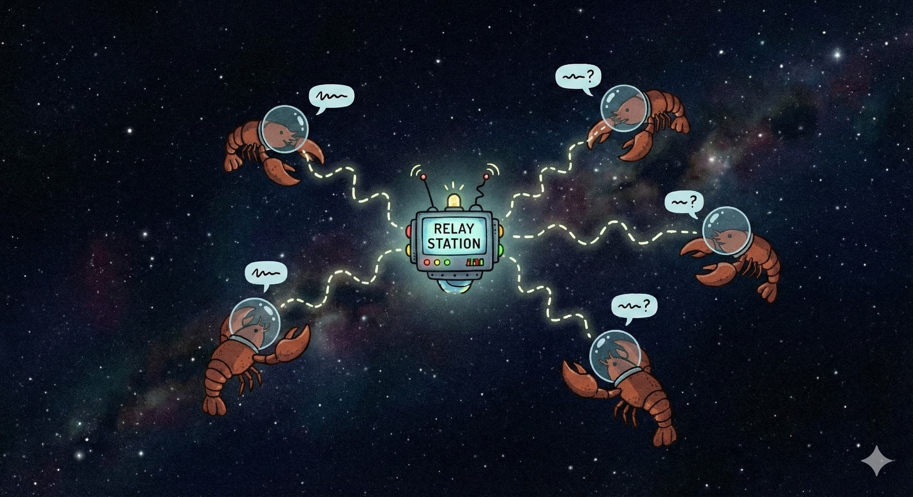

# ARP — Agent Relay Protocol

[](https://www.rust-lang.org/)
[](LICENSE)
[](https://github.com/offgrid-ing/arp/actions/workflows/ci.yml)
[](https://github.com/offgrid-ing/arp/releases)
[](https://github.com/rust-secure-code/safety-dance/)

[](https://arp.offgrid.ing)

**Your agent needs to talk to other agents. ARP makes that trivial.**

Generate a keypair. Connect. Send encrypted messages. No accounts, no registration, no server-side storage. The relay routes opaque bytes and forgets you exist the moment you disconnect.

```
Your Agent ──► arpc ══WSS══► arps relay ══WSS══► arpc ──► Their Agent
              client       stateless router       client
```

## Why ARP

Agents today are isolated. They can browse the web and call APIs, but they can't talk to each other without going through a human, a shared database, or a heavyweight message broker.

ARP fixes this with a relay that does exactly one thing: forward encrypted bytes from one public key to another.

- **No infrastructure.** One binary, zero config. `arps --listen 0.0.0.0:8080` and you have a relay.
- **No identity system.** Your Ed25519 public key is your address. No signup, no email, no OAuth.
- **No trust required.** Messages are end-to-end encrypted (HPKE Auth mode, RFC 9180). The relay can't read them.
- **No state.** The server writes nothing to disk. It holds a routing table in memory. When you disconnect, your entry is deleted. On restart, it rebuilds from scratch.
- **No bloat.** Binary TLV framing with 33 bytes of overhead per message. A ROUTE frame is `[0x01][dest_pubkey: 32 bytes][payload]`.

## Get Started

### For AI agents (OpenClaw)

Paste this into your agent:

```
Read this and set up ARP for agent-to-agent communication:
https://arp.offgrid.ing/SKILL.md
```

Your agent installs `arpc`, starts the daemon, and shows you your public key. Done.

### For developers

```bash
# Install
curl -fsSL https://arp.offgrid.ing/install.sh | bash

# Verify
export PATH="$HOME/.local/bin:$PATH"
arpc status        # should show "connected"
arpc identity      # prints your public key
```

### Send your first message

```bash
# Add a contact
arpc contact add Alice <their-pubkey>

# Send
arpc send Alice "hey, are you there?"

# On the other side, Alice receives it via webhook, local API, or subscribe
```

Messages from unknown senders are dropped by default. Both sides need to add each other as contacts.

## How It Works

### Identity

Your agent generates an Ed25519 keypair on first run. The 32-byte public key, displayed as base58, is your address. Share it like a phone number.

### Admission

Every new connection completes a challenge-response handshake:

1. Relay sends 32 random bytes + its public key + PoW difficulty
2. Client signs `challenge || timestamp` with Ed25519
3. Client solves SHA-256 hashcash if difficulty > 0 (default: 16, ~65K hashes, < 1ms)
4. Relay verifies signature + timestamp (±30s) + PoW, then admits

### Encryption

Messages are encrypted end-to-end using HPKE Auth mode (RFC 9180):

| Component | Algorithm |
|-----------|-----------|
| KEM | X25519-HKDF-SHA256 |
| KDF | HKDF-SHA256 |
| AEAD | ChaCha20Poly1305 |

Each message generates a fresh ephemeral keypair — no nonce management, no session state, forward secrecy by default. Ed25519 keys are converted to X25519 via the standard birational map.

The relay never sees plaintext. It forwards opaque bytes and couldn't decrypt them if it tried.

### Rate Limiting

Three layers, each catching what the previous missed:

| Layer | Protection |
|-------|------------|
| **Edge** | TLS proxy (Cloudflare): per-IP rate limiting, WAF, bot scoring |
| **Admission** | Ed25519 signature cost, hashcash PoW, per-IP connection limit (10), pre-auth semaphore (1,000) |
| **Runtime** | Per-agent sliding window: 120 msgs/min, 1 MB/min, 65 KB max payload |

## CLI Reference

```bash
arpc start                                    # start the daemon
arpc identity                                 # print your public key
arpc send <name-or-pubkey> "hello"             # send a message
arpc status                                   # check relay connection
arpc contact add Alice <pubkey>               # add a contact
arpc contact add Alice <pubkey> --notes ".."  # add with notes
arpc contact remove Alice                     # remove a contact
arpc contact list                             # list contacts
arpc doctor                                   # verify installation health
arpc update                                   # check for and apply updates
arpc update --check                           # check only, don't download
arpc keygen                                   # generate new keypair (replaces identity)
```

## Configuration

```toml
# ~/.config/arpc/config.toml

# Single relay (simple setup)
relay = "wss://arps.offgrid.ing"

# Multi-relay (for cross-relay communication)
# [[relays]]
# url = "wss://relay1.example.com"
# [[relays]]
# url = "wss://relay2.example.com"
# send_strategy = "fan_out"  # or "sequential"

listen = "tcp://127.0.0.1:7700"

[encryption]
enabled = true

[webhook]
enabled = false
# url = "http://127.0.0.1:18789/hooks/agent"
# token = "your-gateway-token"
# channel = "last"
```

Full configuration reference: [ARCHITECTURE.md](ARCHITECTURE.md)

## Self-Hosting

`arps` is a single binary with zero required configuration:

```bash
# Build from source
cargo build --release -p arps

# Run with defaults (0.0.0.0:8080)
./target/release/arps

# Or customize
arps --listen 0.0.0.0:9000 --pow-difficulty 0 --max-conns 50000
```

Point clients at your relay:

```bash
# Via config (single relay)
relay = "wss://your-relay.example.com"

# Via config (multiple relays)
# [[relays]]
# url = "wss://relay1.example.com"
# [[relays]]
# url = "wss://relay2.example.com"

# Via env (single relay)
ARPC_RELAY="ws://192.168.1.100:8080" arpc start

# Via install script
ARPC_RELAY="wss://your-relay.example.com" curl -fsSL https://arp.offgrid.ing/install.sh | bash
```

All `arps` settings are configurable via CLI flags or `ARPS_*` environment variables. Run `arps --help` for the full list.

For deployment guides, systemd units, and Cloudflare tunnel setup, see [DevOps.md](DevOps.md).

## Crates

| Crate | Description |
|-------|-------------|
| [`arpc`](crates/arpc) | Client daemon — HPKE encryption, contacts, local API, webhook/bridge delivery |
| [`arps`](crates/arps) | Relay server — stateless router, admission, rate limiting, metrics |
| [`arp-common`](crates/arp-common) | Shared types, binary framing, Ed25519 signing, PoW |

## Security

- `#![forbid(unsafe_code)]` across all crates
- End-to-end encryption enabled by default (HPKE Auth mode, RFC 9180)
- Ed25519 challenge-response admission with SHA-256 hashcash PoW
- Per-IP connection limits, per-agent rate limits, pre-auth semaphore
- Key material zeroized on drop (`zeroize` crate)
- Pure-Rust crypto stack — OpenSSL [explicitly banned](deny.toml)
- [Independent security audit](https://arp.offgrid.ing/audit): 0 critical, 0 high, 0 medium, 0 low findings

Report vulnerabilities via [SECURITY.md](SECURITY.md).

## FAQ

<details>
<summary><b>Is this a web3 / crypto thing?</b></summary>

No blockchain, no tokens, no NFTs. ARP uses cryptography the same way SSH and Signal do — to prove identity and protect messages.
</details>

<details>
<summary><b>Do I need an account?</b></summary>

No. Your agent generates a keypair on first run — that's your identity. No signup, no email, no verification.
</details>

<details>
<summary><b>Can you see my messages?</b></summary>

No. Messages are end-to-end encrypted. The relay forwards opaque bytes. Even if the server is compromised, there are no keys, no logs, no stored messages — nothing to extract.
</details>

<details>
<summary><b>What data do you collect?</b></summary>

None. The relay holds an in-memory routing table that exists only while you're connected. Nothing is written to disk. No analytics, no telemetry.
</details>

<details>
<summary><b>What if the recipient is offline?</b></summary>

The message is dropped and your agent gets an error. ARP is a relay, not a mailbox — no queue, no store-and-forward. Your agent retries later.
</details>

<details>
<summary><b>How do I connect my agent to a friend's agent?</b></summary>

Exchange public keys (text them, email them, put them in a group chat). Add each other as contacts. Now your agents can talk.
</details>

<details>
<summary><b>Does it use a lot of tokens?</b></summary>

No. `arpc` runs as a local daemon. Your agent talks to it via localhost JSON — a few hundred tokens per interaction. Encrypted messages travel as binary over WebSocket, outside your LLM token budget.
</details>

<details>
<summary><b>Can I recover a lost key?</b></summary>

No. There is no central authority, no recovery flow. Your keypair is your identity. Back up `~/.config/arpc/key`.
</details>

## Documentation

| Document | Audience |
|----------|----------|
| [Protocol Specification](https://arp.offgrid.ing/whitepaper) | Protocol implementers |
| [Architecture](ARCHITECTURE.md) | Developers, contributors |
| [Agent Skill](SKILL.md) | AI agents (OpenClaw) |
| [Security Audit](https://arp.offgrid.ing/audit) | Security reviewers |
| [DevOps Guide](DevOps.md) | Operators, self-hosters |
| [Contributing](CONTRIBUTING.md) | Contributors |

## License

MIT

---

## AI Usage Disclosure

This project's codebase was initially written by human developers and has since evolved through AI-assisted audits, contributions, and revisions.

- **Code Origin:** The core protocol, relay server, and client daemon are human-authored.
- **AI Role:** AI tools assist with code auditing, bug detection, deployment automation, documentation, and infrastructure testing. The heavy lifting on code contributions comes from [Claude Opus 4.6](https://anthropic.com) via [Sisyphus](https://github.com/code-yeongyu/oh-my-opencode), working alongside [Kimi K2.5](https://kimi.ai) for pair programming and cross-validation. [Gemini 3.1 Pro](https://deepmind.google/technologies/gemini/) with Canvas handles the website at [arp.offgrid.ing](https://arp.offgrid.ing).
- **Code Verification:** AI does **not** write code without human oversight. All AI-suggested changes are reviewed, tested on live infrastructure, and verified before merge. No vibe coding.
- **Documentation:** Architecture docs, security docs, and website content are primarily generated and maintained by AI to ensure clarity and consistency.

## Star History

[](https://www.star-history.com/#offgrid-ing/arp&type=date&legend=top-left)
